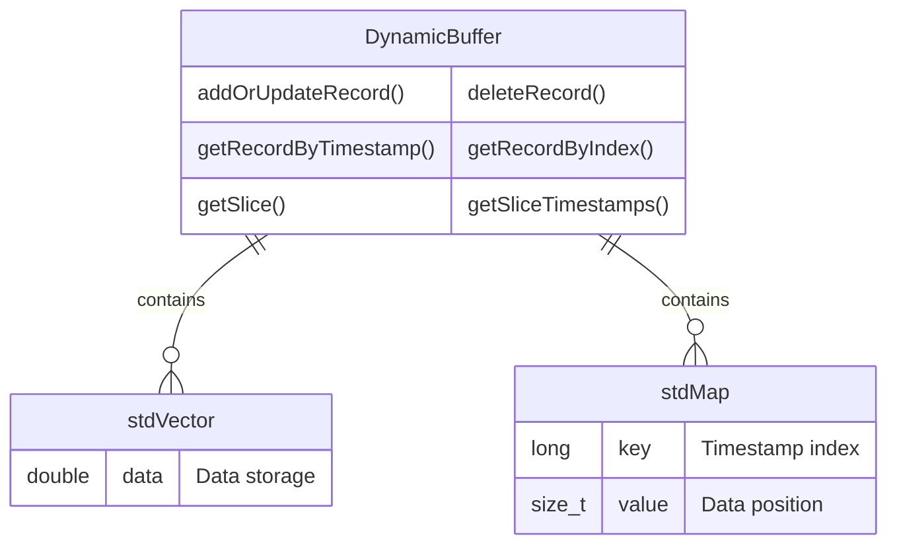
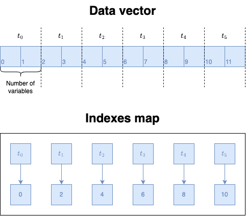
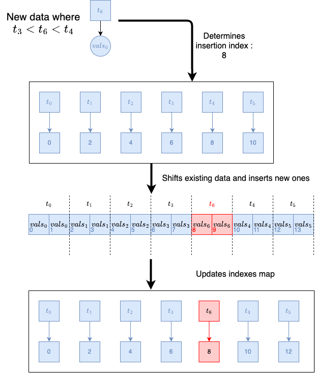

# Dynamic map implementation

This project was designed in order to optimize the use of a btree in a python app. The idea was to optimize some btree operations, such as insert, delete and search. The project was developed in C++ and the python interface was made using the Cython way.

# Map and vector combination
This version (stored in DynamicBufferCpp) represents the latest one and most optimized one.
The C++ part, once compiled and wrapped with Cython, generates a Python class called _PyDynamicBuffer_. This class is charged of handling the data storage and retrieval along with its deletion (cleaning) and handling.
The idea was to store data inside a flattened vector. The C++ vector are assured to be contiguously stored in memory and therefore this could allow the passing of data to python code without having to copy it (and reduce memory calls and improve efficience).

The DynamicBuffer class encapsulates an efficient storage mechanism for time-series data, where each data point is associated with a timestamp and consists of multiple variables (float values). At its core, this class utilizes two primary data structures: a std::vector<double> for storing the actual data in a contiguous block of memory, and a std::map<long, size_t> for maintaining a mapping of timestamps to their corresponding starting indices within the vector. This design choice is pivotal for achieving both spatial efficiency and performance optimization in several key aspects.


**Spatial efficiency and cache friendliness:**

By storing the data inside a _vector_, it is ensured that it is kept in a contiguous block of memory, which is ideal for cache locality. Access patterns can benefit from prefetching and reduced cache misses. In this use case, data can also be transmitted to the python code and converted into a numpy array without copy and with direct memory access.

**Fast lookup with minimal overhead:**

The use of a _map_ to index timestamps allows for efficient lookups of any given timestamp's data. This approach enables quick access to data points without needing to linearly search through the data, speeding up queries based on timestamps. The choice of __std::map__ is based on the use of balanced binary trees, offering efficient insertions and deletions while maintaining sorted order.

**Data limitations and cleaning:**

The vector used to store data is intially allocated at 3 times the size of a window. No data will be removed until the vector is full. This is because when removing data at the beginning of a vector, it automatically shifts every remaining data back to the beginning to keep ensuring memory contiguity. Therefore, the data deletions are limited in occurences to avoid too many memory manipulations.

**Unordered data insertion:**

When inserting unordered data, the indexes map first finds the correct index on where to insert those. Room is then made inside the vector at the given position and data are inserted. In order to make room for new data, the ones coming *after* (chronologically) are shifted further in the vector to free up place for the new data. As data shouldn't be too frequently unordered, or at least too far unordered, the shifting time is forgiveable.



### Last known values
Needed by the filling strategies, last knwown values for each timestamps need to be memorized too. The _PyLastKnownValuesBuffer_ class is a direct child of the _PyDynamicBuffer_, the only difference lies in the *update_last_known_value* method, which automatically propagates the last known value to each entry. For example if there a two variables in the sliding window and only one of them is added for a specific timestamp, the second variable should still have as last known value the one that was before (and not NaN, meaning empty), this method is therefore an adaptation of the *add_or_update_record* present in the _PyDynamicBuffer_ class.

## Cythonization
In order to be wrapped into a Python library later on, the C++ class had to be Cythonized, as it was the most performant way to wrap those classes in Python code. 

Cython is a programming language that serves as a superset of Python, designed to give C-like performance with code that is written mostly in Python. It achieves this by allowing you to add static type declarations, which can then be used to compile the code into efficient C or C++ code. This compiled code is executed much faster than the equivalent Python code because it is turned into machine code that can be directly executed by the CPU.

Those classes had then to be wrapped inside a *DynamicBufferWrapper.pyx* file that handles the conversion between C++ code and Cython.

### Data window extraction
Combining the contiguousity of the data implied by the use of a C++ _vector_ with the Cython and numpy APIs, it is possible to create an object representation in form of a numpy array by directly accessing the memory and making absolutely no copy of it. To do so, one only needs to call the *get_slice_as_numpy* method and passing the current timestamp along with the number of elements to retrieve. In this method, the C++ code is called to retrieve a pointer on the first window's element. Cython code then uses this pointer and the shape informations to create a numpy array representation of the slice like this:
```
def get_slice_as_numpy(self, long timestamp, size_t N):
    cdef size_t sliceSize = 0
    cdef const double *slice = self.thisptr.getSlice(timestamp, N, sliceSize)
    if slice is NULL:
        raise ValueError("Slice cannot be retrieved")

    # Total number of double elements in the slice
    cdef size_t num_elements = sliceSize 
    
    # Calculate the number of rows
    cdef size_t num_rows = num_elements // self.thisptr.getNVariables()  
    cdef np.npy_intp dims[2]
    dims[0] = num_rows
    dims[1] = self.thisptr.getNVariables()

    # Note: Setting mode='c' ensures the NumPy array is C-contiguous
    return np.PyArray_SimpleNewFromData(2, dims, np.NPY_FLOAT64, <void*>slice)
```